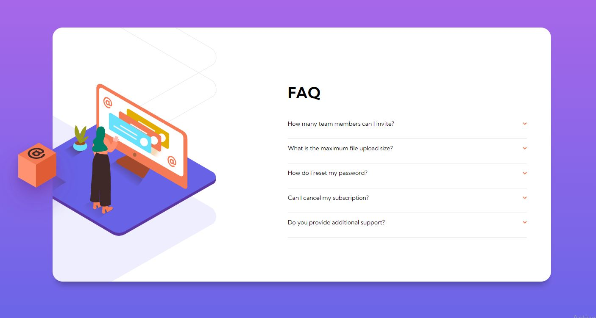
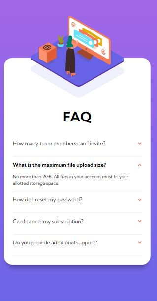

# Frontend Mentor - FAQ accordion card solution

This is a solution to the [FAQ accordion card challenge on Frontend Mentor](https://www.frontendmentor.io/challenges/faq-accordion-card-XlyjD0Oam). Frontend Mentor challenges help you improve your coding skills by building realistic projects.

## Table of contents

- [Overview](#overview)
  - [The challenge](#the-challenge)
  - [Screenshot](#screenshot)
  - [Links](#links)
- [My process](#my-process)
  - [Built with](#built-with)
  - [What I learned](#what-i-learned)
  - [Continued development](#continued-development)
- [Author](#author)

## Overview

### The challenge

Users should be able to:

- View the optimal layout for the component depending on their device's screen size
- See hover states for all interactive elements on the page
- Hide/Show the answer to a question when the question is clicked

### Screenshot

### Links

- Solution URL: [https://github.com/Robert-Rynard/faq-accordion-react](https://github.com/Robert-Rynard/faq-accordion-react)
- Live Site URL: [https://robert-rynard.github.io/faq-accordion-react/](https://robert-rynard.github.io/faq-accordion-react/)

## My process

### Built with

- CSS custom properties
- Flexbox
- Mobile-first workflow
- [React](https://reactjs.org/) - JS library
- CSS Modules

### What I learned

Through completing this challenge I got practice creating apps using react and useState. As well I was able to implement animations to the design and drop downs and style the image to be responsive for all screen sizes and using padding to show full background image while inside an empty div.

### Continued development

Going forward I would like to improve my use of HTML as in this project there were too many divs used that could be better used with sematic HTML. This was the first time implementing animations into my site so I plan on learning more about how they work and how they work with react.

## Author

- Website - [Robert Rynard](https://github.com/Robert-Rynard)
- Frontend Mentor - [@Robert-Rynard](https://www.frontendmentor.io/profile/Robert-Rynard)
- Twitter - [@robert_rynard](https://www.twitter.com/robert_rynard)
